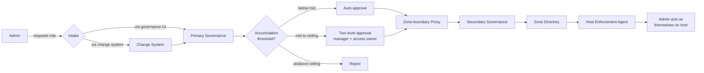
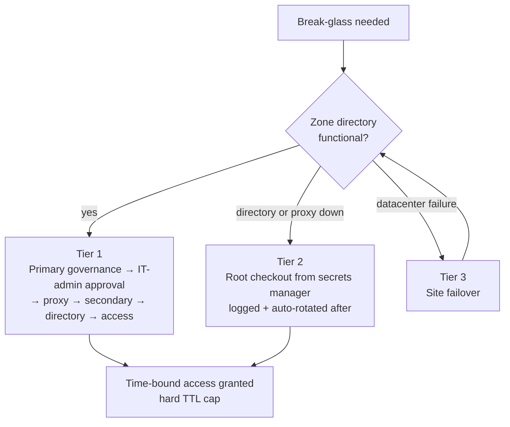
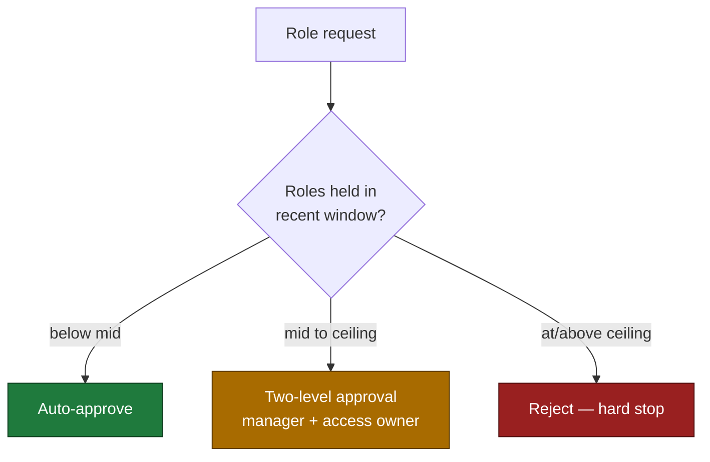
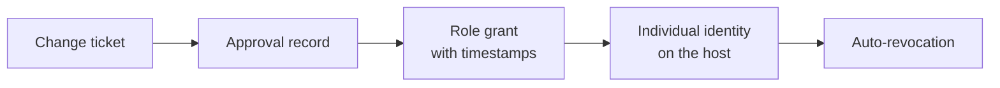

# TEA pattern (Transient Elevated Access) to remediate long-lived privileged access in critical security zones 

*A reference architecture and set of design patterns for delivering individually-attributable, time-bound, fully-audited privileged access to strongly segmented systems.*

---

## The Problem

How do you grant privileged access to highly segmented, high-trust zones — **transient, individually attributable, time-bound, and fully audited** — when your identity governance tooling sits in a *lower*-trust zone and cannot be granted a network path into the systems it must manage?

This is a recurring class of problem in organizations that run regulated, business-critical platforms behind strong network segmentation. It typically presents with the following starting conditions:

- **Standing privileged accounts everywhere.** Each segmented zone carries dozens of persistent, shared service accounts. Multiply across tens of zones and the environment accumulates *thousands* of always-on privileged credentials.
- **Shared-account access patterns.** Admins authenticate through a bastion, hop to a target host, then `sudo` to a shared service account to run privileged commands. Actions are not attributable to an individual.
- **Out-of-band provisioning.** Accounts are created ad-hoc via ticketing (slow — often weeks), live outside identity-governance, and are reviewed only on an annual audit cycle.
- **No continuous certification.** No time-bounding, no automated revocation, no real-time answer to *"who has access to what, right now, and why?"*

### Why it's hard

The fundamental constraint is **trust-zone direction**. Each high-security zone needs a local directory as its access-provisioning point, but the governance tool lives in a management zone classified at *lower* trust than the targets. Security policy will not grant a directory-protocol firewall exception inbound from a lower-trust zone into a higher one — so the very tool meant to govern access cannot reach the systems it must manage.

Layered on top is **organizational drag**: many zones, many admin teams, each comfortable with standing access, all required to adopt a new workflow simultaneously.

> The risk of doing nothing: continued insider-threat exposure, likely compliance-audit failures on privileged-access controls, and no ability to answer the basic governance question above.

---

## Reference Architecture

### Before — Standing access

```
Admin → SSO/Bastion → SSH → SUDO to shared service account
   (dozens of standing accounts per zone, across many zones)
   Reviewed annually · outside governance · shared identity
```

### After — Transient Elevated Access (three paths)

```
PATH 1 · Normal operations (change-driven)
  Change system → Primary governance → Zone-boundary proxy
                → Secondary governance → Zone directory → Target host

PATH 2 · Break-glass (incident-driven)
  Tier 1: directory up   → Primary governance (A/A) → IT admin → access
  Tier 2: directory down → secrets manager → root credential checkout (rotated after)
  Tier 3: site failure   → site failover → falls into Tier 1 or Tier 2

PATH 3 · Batch / ETL (non-interactive)
  Job → secrets manager → credential checkout → execute → check-in → rotate
```

### The hot path: change-driven TEA

Two intake routes feed the same evaluation logic:

- **Via the change system** — the admin lists the required privileged roles on an approved change; on approval, the change system automatically forwards the access request to governance.
- **Via governance directly** — the admin requests the whitelisted TEA role through the governance UI, linked to the approved change.

Every request is evaluated *immediately at submission* against an accumulation threshold (see *Circuit Breaker* below):

- **Below mid threshold** → auto-approved
- **Between mid and ceiling** → routed for two-level approval (manager + access owner)
- **At or above ceiling** → rejected

Making the admin responsible for securing access *before* the change window creates a natural incentive not to hold privileges longer than needed — the longer roles are held, the closer to the ceiling, and the harder future access becomes to obtain.

Once approved, provisioning flows: intake layer → governance API bridge → zone-boundary proxy → secondary governance bridge → native identity APIs → zone directory → host-side enforcement agent. The admin then authenticates **as themselves** on the target host — no shared accounts.



### Identity model: shared accounts → individual identity

The pivotal change is eliminating the `sudo`-to-shared-account pattern. Post-TEA, admins authenticate as individuals; the host-side enforcement agent picks up their personal privileges from the local zone directory, with policy applied via configuration management. **Every privileged action becomes traceable to one person.**

### Non-interactive workloads (batch / ETL)

Batch and ETL jobs use a secrets manager as their credential store:

1. Job checks out credentials at runtime.
2. Job executes with those credentials.
3. On check-in, the secrets manager *immediately rotates* the password.

Result: no standing credentials for automated workloads — the secret is different after every use.

### Revocation

- **Self-revocation** — admins can voluntarily drop access early.
- **Active** — when the change is closed, the change system sends a revocation request to governance; on failure it retries before paging operations.
- **Passive safety net** — a governance scheduler runs frequently (e.g., every minute), scanning all open assignments against their time windows and revoking anything expired — including break-glass roles at their hard TTL cap.

### Break-glass — three-tier fallback

All roles are time-bound; break-glass carries a hard TTL cap (e.g., 48 hours). Both governance instances run active-active with transparent failover.

| Tier | Condition | Flow |
|------|-----------|------|
| **1** | Site incident, zone directory functional | Break-glass request → primary governance → IT-admin approval on the incident call → proxy → secondary governance → zone directory → access. No change-system involvement. |
| **2** | Zone directory or proxy down | Root credentials checked out from the secrets manager, fully logged on the incident record, auto-rotated after resolution. Should be *extremely* rare. |
| **3** | Datacenter-level failure | Site failover; once the secondary site is up, resolves into Tier 1 or Tier 2 depending on what infrastructure is functional. |



### Where state lives

| Component | State owned |
|-----------|-------------|
| Change system | Change requests and lifecycle |
| Primary governance (mgmt zone) | Approval workflows, role definitions, reporting |
| Secondary governance (elevated zone) | Source of truth for privileged provisioning |
| Zone directories | User-to-role membership |
| Host enforcement agent | Real-time access enforcement |
| Secrets manager | TEA credentials for batch/ETL + last-resort break-glass |

---

## Design Patterns & Trade-offs

### Pattern 1 — Dual-instance governance with a zone-boundary proxy

**The trap:** assuming security will grant a directory-protocol firewall exception from a lower-trust zone into a higher one. They generally won't — and shouldn't.

**Alternatives and why they fail:**

| Option | Why rejected |
|--------|--------------|
| Firewall exception for directory traffic inbound to high-security zones | Violates segmentation policy; lower-trust source into higher-trust target. |
| Migrate the existing governance instance into the elevated zone | A mature governance instance carries hundreds of integrations across varied zones; relocating it drags all those paths into the high-security zone. Unacceptable complexity/risk. |
| Deploy governance connectors inside each zone | Connectors initiate *outbound* from the governance instance — they don't solve the trust-direction problem. |

**The pattern:** stand up a *second, purpose-built* governance instance inside the elevated zone. A zone-boundary proxy **breaks and re-establishes** the connection between primary and secondary instances. Because the link uses standard HTTPS (not a directory protocol), the proxy can terminate and inspect traffic — fitting an established, inspectable security pattern rather than fighting policy.

Where the governance platform exposes only native (non-REST) APIs, build a thin **REST bridge** on each instance: the primary bridge exposes governance to the intake UI and change system; the secondary bridge receives provisioning instructions and translates them into native directory operations.

**Trade-off:** more infrastructure (two governance environments + custom bridges) in exchange for clean segmentation compliance and the ability to actually reach high-security targets.

### Pattern 2 — Freeze the old pattern as a forcing function

Immediately halt *new* standing-account creation. This blocks teams temporarily and creates friction — but it prevents the legacy pattern from expanding while the new system is built, and removes any fallback to the old way. Adoption stops being optional.

**Trade-off:** real organizational pressure during the build, requiring consistent communication and visible progress to maintain buy-in.

### Pattern 3 — Change-driven auto-provisioning with whitelisting

Tie TEA access to approved changes. Whitelist the majority of routine roles per zone for auto-provisioning during change windows; route the rest through approval.

**Watch-out:** many workflow engines are *not* designed for conditional step-skipping. Implementing "auto-approve whitelisted, route others" can demand significant unsupported customization and heavy testing. **Validate your platform's customization ceiling early** — what looks like configuration is often custom development.

**Trade-off:** custom code in a critical path vs. an all-manual workflow that frustrates admins and slows incident response.

### Pattern 4 — Privilege-accumulation circuit breaker

A tiered threshold on whitelisted roles, based on how many privileged roles a user has held in a recent window (e.g., the last 48 hours). Break-glass roles are exempt and always require elevated approval.

| Tier | Condition | Action |
|------|-----------|--------|
| Floor–Mid | Below mid threshold | Auto-approved — routine work, no friction. |
| Mid–Ceiling | Between mid and ceiling | Two-level approval — manager and access owner both sign off. |
| Ceiling+ | At or above ceiling | Rejected — hard stop, no further accumulation. |



**Rationale:** a bad actor can request short-lived roles for legitimate-looking changes, staying under the radar on any single request. The tiered threshold detects the *pattern* — rapid multi-zone acquisition triggers human review at mid, then a hard ceiling that blocks further accumulation entirely.

### Role naming & ownership

- Adopt a consistent role-naming convention encoding **zone + access type + target**.
- Split roles into **whitelisted** (subject to the accumulation threshold) and **break-glass** (emergency-only, always require elevated approval).
- Assign every role an **access owner** at provisioning time — the person authorized to approve access to that specific role, and one of the two approvers when the threshold is exceeded.

---

## Risks & Failure Modes

| Failure mode | Impact | Mitigation |
|--------------|--------|------------|
| Zone-boundary proxy down | No TEA via normal path | Fall to Tier 2 (secrets-manager root checkout) |
| Secondary governance node failure | None — transparent | Active-active cluster fails over |
| Primary governance node failure | None — transparent | Active-active cluster fails over |
| Zone directory controller down | Cannot provision to that zone | Fall to Tier 2 (secrets manager) |
| Change-system integration breaks | Auto-provisioning stops | Manual approval path still functional |
| Revocation callback fails | Role not revoked on change close | Retry before paging ops; scheduler catches expired roles |
| Enforcement-agent cache stale | Revocation delay | Low risk — near-instant pickup, short cache TTL |

---

## Outcomes to Target

These are the kinds of results this architecture is designed to produce.

| Metric | Before | After |
|--------|--------|-------|
| Standing privileged accounts | Thousands (dozens per zone × many zones) | Effectively zero — consolidated into a fraction of TEA roles |
| Active privileged access at any moment | ~100% always active | ~10–20% of TEA roles active at any time |
| Time to obtain privileged access | Weeks (ticket-driven) | Instant — available at change time |
| Access governance | Annual audit, out of band | Continuous — time-bound, auto-revoked, governed |
| Insider-privilege security incidents | Non-zero | Zero post-implementation |

### Audit trail

A complete, gapless compliance chain:



| Layer | What it records |
|-------|-----------------|
| Change system | The change that justified the access |
| Governance (current-state) | Who has access to what, right now |
| Governance (audit history) | Who had access, when — with approval metadata |
| Secrets manager | Break-glass credential checkout logs |
| Incident records | Break-glass checkouts tied to specific incidents |
| Target host (enforcement + config mgmt) | Individual identity — no shared accounts obscuring attribution |

---

## Evolution & Maturity Path

Where to take this architecture next.

### Custom mTLS directory connector

Instead of routing through a built-in directory connector, build a lightweight connector that wraps directory operations over **HTTPS with mutual TLS**. This:

- **Eliminates the zone-trust / firewall-exception problem entirely** — HTTPS runs on a well-known port with established inspection and access-control tooling (proxies, WAFs, DLP). The core objection to directory protocols is the lack of safe cross-zone inspection; HTTPS/mTLS fits existing infrastructure.
- **Strengthens trust** — both sides authenticate via certificates, a stronger model than plain directory traffic.
- **Removes the need** for a second governance instance and boundary proxy.
- **Gives full control** over protocol and security model, independent of connector architecture.

### Privilege index per identity

Replace "scan audit history on every request" with a **privilege index** per identity that:

- Increases on every privileged-role addition.
- Decays gradually over time.
- Resets to baseline after a defined cool-off period.

The auto-approve / two-level / reject decision becomes a simple comparison against the index — more performant, more elegant, and a better reflection of real risk (frequent usage in a short window is riskier than the same count spread out).

### Time-based access-pattern mapping

On every role drop, fire an event. A reporting consumer aggregates events over a rolling 2–3 month window to produce access-pattern graphs per user, per zone, per role — enabling:

- **Anomaly detection** — flag deviations from a user's historical baseline.
- **Role optimization** — find roles consistently requested together and consider consolidating.
- **Capacity planning** — understand peak windows and scale accordingly.
- **Audit storytelling** — give auditors trend data, not just point-in-time snapshots.

---

## Technology Roles (vendor-neutral)

| Role in the architecture | Responsibility |
|--------------------------|----------------|
| Identity governance platform | Approval workflows, governance, role definitions (primary); privileged provisioning to high-security zones (secondary) |
| Zone directory service | Per-zone user-to-role mapping |
| Host enforcement agent | Real-time access enforcement via directory group membership |
| Change-management system | TEA triggers and auto-revocation |
| Workflow / approval engine | Approval orchestration — customized for whitelisting logic |
| Zone-boundary proxy | Inspectable HTTPS bridge between governance instances across zone boundaries |
| Native identity APIs | The governance platform's underlying API framework, invoked by the REST bridges |
| REST bridge (primary) | Exposes native governance APIs to the UI and change system |
| REST bridge (secondary) | Receives provisioning instructions and relays them into directory operations |
| Secrets manager | TEA credentials for batch/ETL (routine) + last-resort break-glass (rare); immediate rotation after every checkout |
| Configuration management | Policy enforcement on hosts — controls enforcement-agent privilege mapping |
| Bastion / jump host | Access entry point — SSO in, select a zone host, then connect to the target |

---

## License

This documentation is licensed under [CC BY 4.0](https://creativecommons.org/licenses/by/4.0/). You are free to share and adapt it for any purpose, including commercially, with appropriate attribution.
